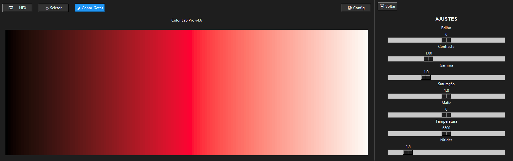
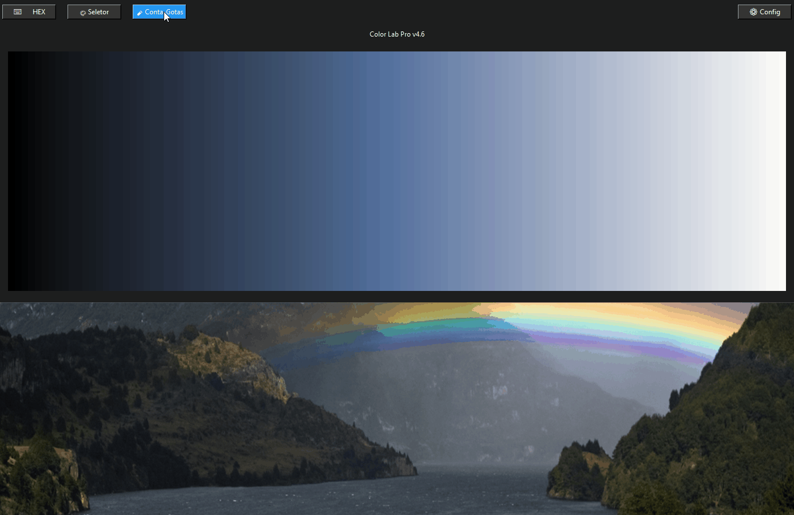

# 🧪 Color Lab Pro (v5.1 - Mixer & Accessibility Update)

**Color Lab Pro** é uma ferramenta avançada de análise cromática e geração de gradientes perceptuais, desenvolvida para profissionais de design e desenvolvedores que buscam precisão cirúrgica na manipulação de cores.

O projeto foca na **fidelidade visual**, utilizando modelos matemáticos que respeitam a percepção humana em vez de apenas cálculos aritméticos simples em RGB.

---

##  Novas Implementações (v5.0)

###  Mixer de Cores Perceptual (Espaço LAB)
Diferente de mixers comuns que geram tons acinzentados ao misturar cores opostas no RGB, o Color Lab Pro realiza a interpolação no espaço de cores **CIELAB**.
* **Mistura Natural:** Ao converter para as coordenadas L*(Luminosidade/Lightness), a*(Eixo Verde-Vermelho), b*(Eixo Azul-Amarelo), o algoritmo preserva a vibração e a luminosidade percebida.
* **Transição Suave:** Ideal para criar paletas e gradientes que parecem "reais" aos olhos humanos, simulando o comportamento físico da luz e pigmentos.

###  Conformidade e Acessibilidade (WCAG 2.1)
Implementação de verificador de contraste automatizado baseado nas normas internacionais de acessibilidade web.
* **Score AA e AAA:** Cálculo em tempo real do contraste entre texto e fundo.
* **Fórmula de Luminância Relativa:** Utiliza a fórmula oficial da W3C:
  $$Contrast = \frac{L1 + 0.05}{L2 + 0.05}$$
  Onde $L$ representa a luminância relativa da cor, garantindo que suas escolhas de design sejam inclusivas para usuários com baixa visão.

---

##  Funcionalidades Principais

###  Precisão Científica
Diferente de seletores comuns, este laboratório utiliza a fórmula **Delta E (CIE76)** para calcular a diferença entre tons. Isso garante que os gradientes gerados sejam perfeitamente uniformes para a percepção humana.

###  Conta-Gotas e Lupa de Precisão
* **Magnifier 10x:** Captura qualquer pixel da tela com uma lupa circular.
* **Interpolação de Pixel:** Utiliza o método *Nearest Neighbor* totalmente ajustável para manter a nitidez técnica dos pixels capturados.

###  Reconhecimento de Imagem
* Processamento via algoritmos de **K-Means Clustering** e **Quantização de Cores**, permitindo extrair as cores dominantes de qualquer imagem importada com alta fidelidade.

###  Simulação de Daltonismo
Simulação em tempo real de como a paleta é visualizada por diferentes perfis:
* **Deuteranopia e Protanopia** (Vermelho-Verde).
* **Tritanopia** (Azul-Amarelo).
* **Acromatopsia** (Cegueira total de cores).

###  Ajustes Profissionais de Imagem
Controle total sobre o sinal da cor através de sliders de:
* Brilho, Contraste e Gamma.
* Saturação e Matiz (Hue).
* **Temperatura de Cor (Kelvin):** Simulação térmica de 1000K a 12000K.

---

##  Tecnologias Utilizadas
* **Linguagem:** Python 3.12+
* **Interface Gráfica:** Tkinter
* **Processamento de Imagem:** Pillow (PIL)
* **Automação de Sistema:** PyAutoGUI
* **Matemática de Cores:** Cálculos trigonométricos personalizados para conversões XYZ e CIELAB.

---

##  Demonstração



### Conta-Gotas em Ação


---

## ⚙️ Instalação e Execução

1. **Clone o repositório:**
   ```bash
   git clone [https://github.com/gabrielphilipus/Color-Lab-Pro.git](https://github.com/gabrielphilipus/Color-Lab-Pro.git)
